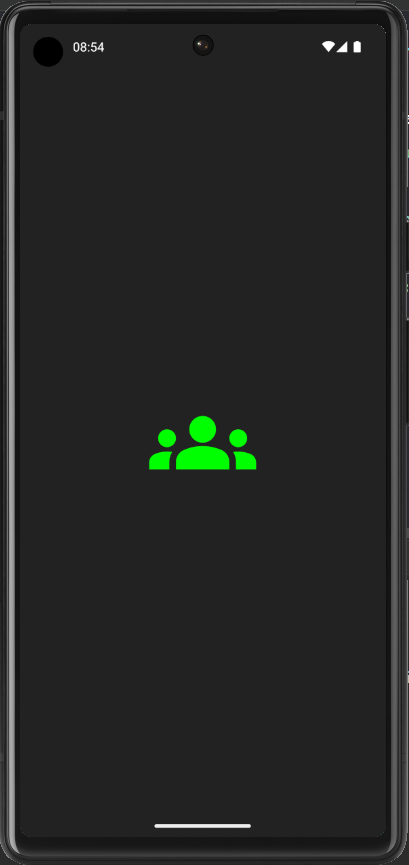
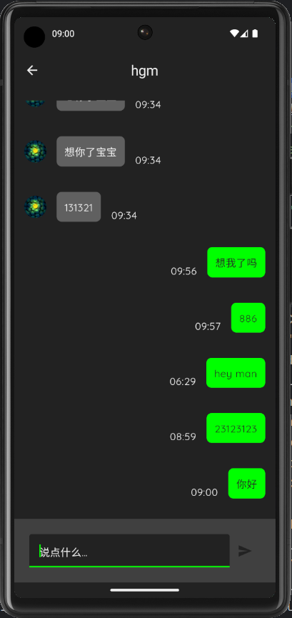
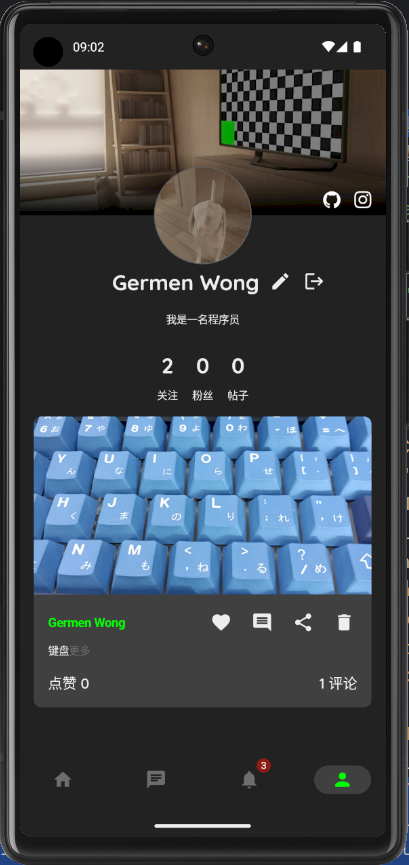

## CodersHub

### 简介

CodersHub 是一个基于 Jetpack Compose 实现的关于程序员类型的社交网络应用程序（学习用途）

使用到的技术栈：

* **语言**：Kotlin
* **UI框架**：Jetpack Compose + MVI
* **依赖注入**：Dagger Hilt
* **网络库**：OKHttp、Retrofilt、Scarlet
* **图片加载库**：Coil、uCrop

### 功能模块

1. 登录注册模块（身份验证）

   

2. Feed流模块（推流的内容是用户已关注的）

   

3. 聊天模块（用户之间单对单聊天、群聊功能未实现）

   

4. 动态模块（主要用于接收关注以及关于帖子动态的消息）

5. 个人模块（个人页展示详细信息）

   

